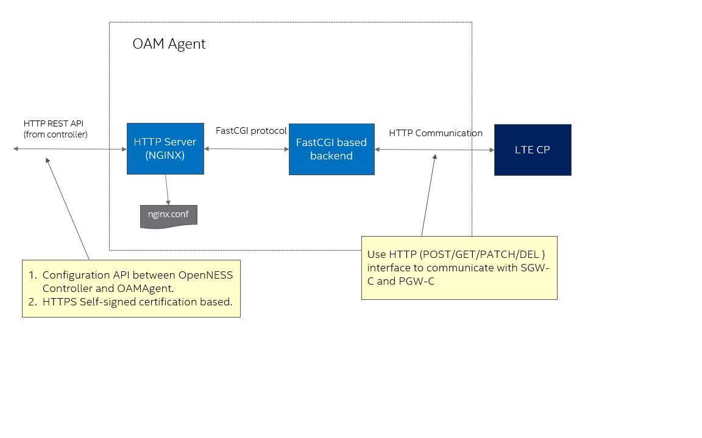

```text
SPDX-License-Identifier: Apache-2.0
Copyright © 2019 Intel Corporation and Smart-Edge.com, Inc.
```
# Purpose

This document is intended for EPC OAMAgent setup and serves as a guide on setting up agent that will play as interface between controller and EPC control plane,

# EPC OAMAgent Community Edition

This repository contains the project for the EPC OAMAgent Community Edition.

## Directory structure

The EPC OAMAgent supports EPC-Cplane configuration from MEC controller. So provides two basic components as below:

- backend: CGI backend source files to handle HTTP(S) commmunciation with controller
- http: only provide guide about how to configure and start NGINX , also including how to generate self-signed certification files for HTTPS

## Architecture Overview

Figure 1. OAMAgent Architecture.



- OAMAgent receive configuration API from OpenNESS controller with APN, TAC, S1u-IP ...etc. And return uuid for further API transaction.
- After processing configuration API, OAMAgent will use HTTP protocal to communicate with LTE Control Plane for configuration. Currently this interface is for demo purpose. 

## Installation, Build and Run

- Setup, Generate Self-signed certification files and Run NGINX according to readme in sub-directory: http
- Setup, Build and Run HTTPS based backend according to readme in the sub-directory: backend
- Notice: All installation scripts are based and verified on CentOS 7.6 x86_64 operating system. 

# Troubleshooting

* Script Failed on no-CentOS operating system

  Change "yum" in the script to other installation command, for example: apt-get install for ubuntu.

* Script stops/freezes at fetching packages

  Make sure that proxy is configured properly in operating system.

* Controller not able to communicate with OAMAgent

  Make sure that it is not caused by HTTPS proxy setting for the operating system that OAMAgent is running on.
  If finding "Permission denied" in the nginx log, can use command: setenforce=0

* Log files

  EPC OAMAgen uses syslog as logging tool. So can find debug information from /var/log/message.


